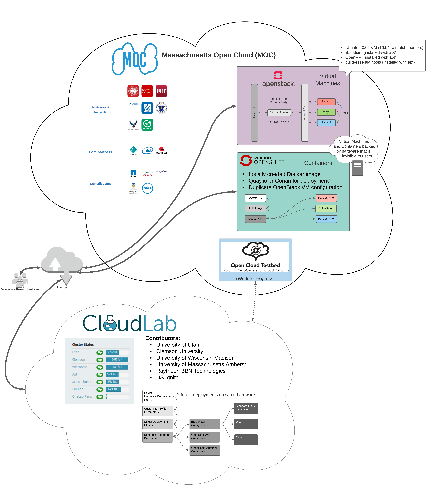
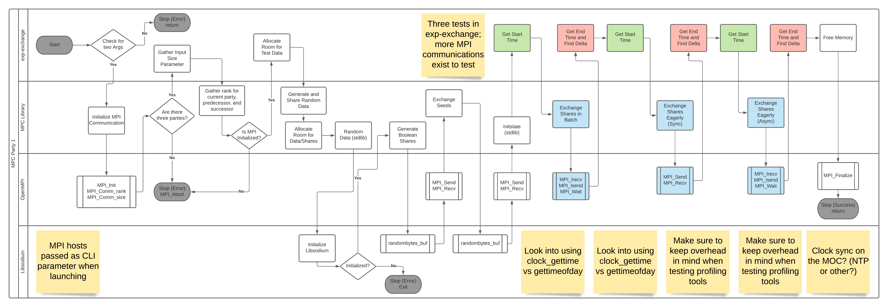

# Secure_MultiParty Background Information:
Performance analysis of secure multi-party computations in the cloud

Project Logistics:
Mentors: John Liagouris email: liagos@bu.edu;  Vasiliki Kalavri email: vkalavri@bu.edu;
Will the project be open source: yes

Preferred Past Experience:
Strong C/C++ programming skills: Required
OpenStack/OpenShift: Nice to have
MPI (Message Passing Interface): Nice to have
MPC (Multi-Party Computation): Nice to have

Project Overview:
Background: Secure multi-party computation (MPC) refers to a family of cryptographic protocols that allows distrustful parties to jointly perform arbitrary data computations while keeping the inputs and intermediate data of the computation private. Compared to traditional non-secure computations, MPC requires exchanging more data between parties and its performance relies heavily on the communication layer.

Project Specifics: In this project students will instrument and profile distributed MPC applications in the cloud with the goal to identify performance bottlenecks and potential optimizations. The analysis will focus on the networking layer. Students will experiment with different deployments, network libraries, and communication patterns (sync vs async) to identify optimal solutions based on the workload characteristics.

Some Technologies you will learn/use:
How to deploy applications in the cloud using VMs and OpenShift containers
How to instrument and profile distributed applications
MPI libraries: https://github.com/open-mpi/ompi , https://github.com/pmodels/mpich
MPC protocols: https://www.youtube.com/watch?v=P2MmO458xu4

---
# Table of Contents
* [Links to other Documentation](#links-to-other-documentation)
* [Repo Organization](#repo-organization)
* [Project Proposal](#project-proposal)
  * [Team Members](##team-members)
  * [Team Typical Schedule](##team-typical-schedule)
* [Visions and Goals of the Project](#visions-and-goals-of-the-project)
  * [Vision Statement](##vision-statement)
  * [Goals](##goals)
* [Users/Personas of the Project](#users/personas-of-the-project)
  * [Users/Personas of Interest](##users/personas-of-interest)
  * [Users/Personas List](##users/personas-list)
    * [Users in Scope](###users-in-scope)
    * [Users out of Scope](###users-out-of-scope)
* [Scope and Features of the Project](#scope-and-features-of-the-project)
  * [Primary Project Scope](##primary-project-scope)
  * [Stretch Features Scope](##stretch-features-scope)
  * [Outside of Scope](##outside-of-scope)
* [Solution Concept](#solution-concept)
  * [High-level Solution Outline](##high-level-solution-outline)
    * [Architectural Diagrams](###architectural-diagrams)
    * [Design Implications and Discussion](###design-implications-and-discussion)
* [Acceptance Criteria](#acceptance-criteria)
* [Release Planning](#release-planning)
  * [Links to Presentations](##links-to-presentations)
  * [Some Preliminary Goals by Sprint](##some-preliminary-goals-by-sprint)
* [General Comments](#general-comments)

---
# Links to other Documentation
* [SIMPLE START: TRY THIS GUIDE FIRST](documentation/simple_start.md)
* [Original Mentor Documentation](documentation/original/INSTRUCTIONS.md)
* [Ansible Deployment Notes](documentation/ansible/deployment.md)
* CloudLab Documents
  * [CloudLab Hello World](documentation/cloudlab/cloudlab_setup.md)
  * [Initial Single Bare-Metal Setup](documentation/cloudlab/baremetal_test.md)
  * [Initial Multi Bare-Metal Setup](documentation/cloudlab/multibaremetals.md)
  * [Custom Topology Geni-Lib Setup](documentation/cloudlab/custom_setup.md)
* Container Documents
  * [Docker Notes](documentation/docker/docker_notes.md)
  * OpenShift Notes
    * [MOC Container Creation](documentation/openshift/moc_container_creation.md)
    * [OpenShift Basics](documentation/openshift/OpenShift_basics.md)
    * [Container Instantiation](documentation/openshift/openshift_container_instantiation.md)
    * [Conan Deployment](documentation/openshift/deployment_using_conan.md) *EMPTY*
    * [Minishift Notes](documentation/openshift/minishift.md) *EMPTY*
    * [Sample Container Setup](documentation/openshift/setting_up__sample_container.md) *EMPTY*
    * [C Container Setup](documentation/openshift/setting_up_c_based_container.md) *EMPTY*
* OpenStack Documents
  * [VM creation on OpenStack](documentation/openstack/moc_vm_creation.md)
  * [Primary Node Setup (Specific commands)](documentation/openstack/cc-mpc-main_setup.md)
  * [Secondary Node Setup (Cloning)](documentation/openstack/cc-mpc-secondary_setup.md)
  * [Libsodium Config on VM](documentation/openstack/libsodium_moc_vm.md)
  * [Testing MPI on VMs](documentation/openstack/mpi_moc_vm_test.md)
  * [SSH Configuration Notes](documentation/openstack/ssh_notes.md)
* Poster Session
  * [Tex](documentation/poster/ec528_poster.tex)
  * [Syle](documentation/poster/beamerthemeI6dv.sty)
  * [PDF](documentation/poster/ec528_poster.pdf)

---
# Repo Organization
* ansible: Contains playbooks and environments for ansible deployment
* baremetal: Contains scripts used for CloudLab experiments
* container: Contains scripts and configuration files for local Docker creation and OpenShift deployments
* documentation: Contains multiple folders and markdown files (linked from previous section)
* experiments: Mentor provided and team modified source code for MPC experiments
* Images: Pictures used inside documentation
* retrieved: Folder for storing data retrieved for experiments, ignored by .gitignore unless forced
* scripts_other: Miscellaneous scripts (e.g. ssh key utility)
* src: Mentor provided MPC library source code
* tests: Basic tests provided by mentors for verifying MPC library

---
# Project Proposal:

*[Return to TOC](#table-of-contents)*

## Team Members:
Role | Name | Email
-----|------|------
Developer | Hasnain Abdur Rehman| hasnain@bu.edu
Developer | Pierre-François Wolfe | pwolfe@bu.edu
Developer | Samyak Jain | samyakj@bu.edu
Developer | Suli Hu | sulihu@bu.edu
Developer | Yufeng Lin | yflin@bu.edu
Mentor/Client | John Liagouris | liagos@bu.edu
Mentor/Client | Vasiliki Kalavri | vkalavri@bu.edu
Subject-Matter Expert | Mayank Varia | varia@bu.edu

## Team Typical Schedule:

* Agreed upon "morning" scrums/meetings at 7:30 AM EST being the best match for the three timezones.
* Meetings to occur daily or every other day (to be determined over Sprint 2 depending on effectiveness)
* Weekly mentor meeting Tuesdays at 8:00 PM EST

*Note: Times in EST*

*Scheduling tool suggested by Michael Daitzman* - [when2meet team link](https://www.when2meet.com/?9902998-F7BcE)

# Visions and Goals of the Project:

*[Return to TOC](#table-of-contents)*

## Vision Statement
This project aims to deploy a C-based implementation of a 3-party Secure Multi Party Computation program on the Mass Open Cloud under multiple cloud-based and simple bare-metal deployment configurations. After deployment, the project will analyze and compare the performance of these deployments using some standardized benchmarks. In addition, this project seeks to optimize the cloud based implementations by exploring the design space options for MPC while search for possible bottlenecks. Where possible, bottlenecks will be addressed to improve performance of MPC in the cloud.

## Goals
A simplified breakdown of the project into high level goals includes:

* Deployment of the Secure-MPC on multiple cloud-based and bare-metal platforms.
* Functionality testing and verification of deployments.
* Profiling and comparing each deployment configuration on [Massachusetts Open Cloud (MOC)](https://massopen.cloud/) with respect to some benchmark specifications. Mentors have provided the following guidance based on their research interests:
  * Focus on most fundamental operations (MPC primitives) implemented in the codebase. The performance of the relational queries and the "plans" of multiple relational queries is dependent on the primitive building blocks.
  * Specifically consider "exchange" operations starting by using the "exp-exchange" experiment. The main expectation when using a Secret Sharing MPC approach is that communication between will be the primary bottleneck and "exchange" is the basic communication function used in this MPC implementation.
  * When using "exchange" the mentors have tested batched operation where OpenMPI is provided an array of data and allowed to transmit and receive it in the way it prefers. Additionally they tested both blocking and non-blocking (sync and async) MPI message sending element by element (iterating over all the data to be sent).
    * Seek to understand what the performance difference between these operations is (if matching Mentor results the batched operations will be fastest)
    * Why is there an additional performance hit for sync operations relative to async operations? (If this result is recreated as expected by the mentors)
    * What controls/parameters are there that can influence the behavior of these specific communication approaches?
* Design space exploration of the Secure MPC deployments to increase performance/benchmark scores.
  * Fundamentally: where is the performance going? (library, OS, elsewhere, ...)
  * How critical are different hardware characteristics (some suggestions: kernel bypass, NIC offload, RDMA,..)
    * Note: It might be possible to access some very new Intel machines at the MOC in a limited capacity.
    * Is VM vs bare metal the key question? (Jonathan notes this may not be of as much import) If we do desire to test such a test, requesting bare metal access on the OpenCloud Testbed will allow for comparison across the same hardware (though require more setup).
      * Note: look at CloudLab for images that might make this easier/faster to deploy.
* Determining the best performing deployment configuration across all deployments done.

**__Questions:__**
* Configuration/launch tools to recreate different run scenarios on the MOC?
  * Automated testing/profiling chain to gather new data with different changes?
  * Improved frontend? What is the current user interface and who can/can't make use of it?
    * Are we appropriately serving the target user audience? (Domain experts, outsiders, other?)
  * Improved backend?
  * What existing benchmarks are there (if any) that we should be employing?
    * Looking at the benchmarks used by the mentors (gettimeofday for start and stop of individual tests) to get original results. This should at the very least be run multiple times to obtain several samples, preferably augment the test (as done in EC527) by automatically having multiple test iterations and outputting data in a csv format for easy analysis/plotting with other tools.
    * Will look into MPI benchmarks further to examine the communication between parties
  * Do we want to compare against other MPC implementations?
    * If so, are we going to compare different implementations of secret sharing systems only?
    * Currently only focusing on deploying MPC on different platforms to test and improve performance. Will maybe look at different implementations as a *STRETCH GOAL*.
  * Alternately, do we just want to understand how the infrastructure impacts the application and not perform any comparisons?
  * Look for where the performance is going - computation or communication; cloud hardware or software
    * Would Grafana be of any use? (CloudLab with OpenStack makes it available)

---
# Users/Personas of the Project:

*[Return to TOC](#table-of-contents)*

## Users/Personas of Interest
Since this is a deployment of a specialized MPC implementation as a research-output on the Mass Open Cloud, the quintessential users of this project would be the initial MPC development team.

## Users/Personas List

### Users in Scope

* Researchers/Research Team (e.g. John, Vasia, other faculty, students etc.) especially those using the MOC/CloudLab
  * Software oriented: changes to software/deployment environment (focusing on traditional x86 hardware)
  * ~Hardware oriented~ Out of scope, while GPU, FPGA, or other accelerators are of interest generally this does not fit with our mentors main goals.
  * ~MPC (algorithm) oriented~ Catering to cryptographers is out of scope. While the MPC implementation should be useable by many groups, providing cryptographic algorithmic improvements is not our focus.
* Users of the MOC/CloudLab who are new to MPC
  * Those who desire to run an MPC program experimentally (We will document as much as possible to help a new user employ the functions implemented by the Mentors)
  * Those who can benefit from deployment or testing automation/instructions developed during this work (even if not related to MPC): We aim to provide documentation where necessary and scripts/utilities where possible that provide guidance for deploying and testing within different environments on the MOC and CloudLab.

### Users out of Scope

* Some additional but unlikely users to be targeted in this project:
  * Researchers using MPC on MOC
    * Cloud Administrator
    * Providers/Individuals acting as separate MPC parties/evaluators?
  * MOC Client using MPC
    * MPC non-expert sub-type
    * Cloud Computing non-expert sub-type

---
# Scope and Features of the Project:

*[Return to TOC](#table-of-contents)*

## Primary Project Scope:

* Deployment of the Secure MPC on the following platforms:
  * Virtual Machines (using OpenStack)
  * Containers (using OpenShift)
  * Bare Metal Machines (using OpenStack)
  * Linux Unikernel (UKL) **STRETCH GOAL**
* Generation of repeatable execution configurations and a generalized interface for the cloud deployments.
  * Creating launching scripts and configuration files for launch profiles.
  * Providing greater ease of use/recreation of specific modes/tests.
  * Documentation where scripted automation is not feasible.
* Analysis of the various MPC ~implementations~ deployments (we are mostly interested in the relative performance of this specific MPC implementation under different test conditions)
  * Functionality testing and verification of the deployments. Primarily using Mentor provided verification.
  * Determine appropriate performance metrics of interest for the MPC deployments.
    * Time/Processor Cycles for completion
    * Resources utilized during computation (peak/average CPU, RAM, network,...)
  * Identify any relevant benchmarking/profiling tools available on the [Massachusetts Open Cloud (MOC)](https://massopen.cloud/).
    * Grafana?
  * Follow Mentor suggestions for which parameters are of greatest interest.
    * Consider exchange primitive (anticipated critical bottleneck)
    * Mentors tested batched, and iterated MPI transactions but sync and async but want us to further explore this space and provide greater clarity into what results are achieved and why.
  * As needed, instrument the MPC code in order to obtain performance data making sure to add minimal overhead.
    * Initially use "gettimeofday" as provided in initial Mentor testing
    * Some other possible tools:
      * gprof (flat profile and call graph)
      * perf
      * Oprofile
      * [VampirTrace is suggested by OpenMP](https://www.open-mpi.org/faq/?category=perftools)
        * VampirTrace appears to no longer be developed but instead [Score-P](https://www.vi-hps.org/projects/score-p) is suggested
          * [Some score-p suggestions/tips](https://hpc-wiki.info/hpc/Score-P)
          * Score-p [identifies a number of tools](http://scorepci.pages.jsc.fz-juelich.de/scorep-pipelines/docs/scorep-6.0/html/index.html) that may be of use in visualizing the traces it collects
          * Scalasca may be a good tool to use for viewing the traces
        * [Vampir](https://vampir.eu/) the viewing tool still appears to be receiving updatates...
      * valgrind (memory utilization)
      * Note: Mentors did suggest being very careful about the overhead when using these different profiling tools so as not to obtain skewed results.
      * Note: Mentors also suggested ensuring all test capture data is kept in memory until the end of an experiment (to avoid disk I/O impacting the results)
      * Note: Mentors also recommend looking more carefully into the profiling tools to determine which truely provide an exact execution trace (vs. sampled/other data)
  * Writing/Coding benchmark tests for each deployment.
    * Improvements/extensions to existing "gettimeofday" measurements
  * Execute profiling tests for the different deployment configurations on the MOC.
    * Ideally any tests initially performed on VMs can be replicated in the other test environments with minimal changes.
  * Generating a comparison report for the test runs.
    * Determine the best performing deployment configuration across all deployments made.

## Stretch Features Scope:
*TODO - Further Discussion Needed*
* Design space exploration of the Secure MPC deployments to increase performance/benchmark scores.
  * ~Configuring MPI settings and trying different modes (sync vs async) to achieve minimal communication bottleneck.~ Moved to within scope as mentors indicated specific interest in the exchange operation under MPI conditions but de-emphasized testing of higher level relative operators (which was originally anticipated)
  * Testing communication protocols other than MPI to gain performance improvement. (Could be a direction of exploration but of less immediate mentor interest)
  * Exploring alternatives to the current single-process per party paradigm. (While using multiple threads will undoubtedly be helpful, our focus will likely be on primitives and using multiple threads is less likely to be of import at that level of testing)
     * Multithreading (e.g. OpenMP, pthreads, ...)  
  * Identifying bottlenecks and other areas for improvement to the library as implemented.
* ~Evaluate performance of MPC implementation on top of a Linux micro-kernel~ Moved to primary scope because of interest but flagged as "Stretch Goal"
* Define our own benchmark targeting specific characteristics of MPC workloads.
  * Are there measurements or types of workloads that are not represented in our other tests?
  * This goal is a bit nebulous; would there be certain combinations of primitives that are representative of the composition of certain higher level task (relational query plans for example) of interest? This would be interesting to explore but likely requires better understanding of the performance of MPC primitives first.

## ~Outside of Scope:~
*~The following are clearly being mentioned to be out of scope of this project~*
* ~A GUI for the Secure-MPC deployments (for outside clients who might want to use a generalized or configured version of the software).~

---
# Solution Concept:

*[Return to TOC](#table-of-contents)*

## High-level Solution Outline

### Architectural Diagrams

*HIGH LEVEL OVERVIEW - TEST DEPLOYMENTS FOR PROJECT*

This diagram shows how the different resources we are using for our deployments are organized and managed at a high level. The MOC and CloudLab are two separate but affiliated projects. CloudLab has focused on providing hardware access to researchers for experiments. The MOC is focused on developing a model for a production public cloud in which multiple stakeholders work collaboratively to operate the infrastructure. Providing researcher access to a real production cloud will also enable more novel data insights. Collaboratively, the MOC and CloudLab are working on the Open Cloud Testbed which aims to use software management from both projects to provide access to new FPGA hardware through the MOC while also enabling federated access to these resources to CloudLab users.

For our current work, we are using the OpenStack and OpenShift environments that are available through the MOC for initial testing of the MPC codebase in different deployement environments. The CloudLab hardware is being explored such that bare metal MPC tests can be conducted on some nodes allocated there. Additionally, the OpenStack and OpenShift tests that are initially being run on the MOC can be reproduced on the same hardware used for the bare metal tests. This will result in a more even comparison of the different deployment approaches.

*DETAIL OF INITIAL TEST BEING PROFILED*

The mentors have provided a number of tests they had run on their MPC codebase as well as some direction on what they see as the highest priority tests for assessing performance. The diagram below shows the general execution flow of the test we are currently focusing on profiling. It includes several different types of MPI data exchange operations. Running this test on the MOC OpenStack VMs we deployed we were able to recreate the same results as our mentors. While doing so we identified some improvements we plan to make that will make including automatically performing additional test iteration, modifying the timers being used, and improving the output format for more rapid analysis. Additionally there are some other MPI Tx and Rx functions we may consider using for exchange and we plan to explore how synchronous vs. asynchronous and eager vs. batched communications perform for different test conditions so that we can better understand why the initial results appear to indicate better performance for asynchronous communication.

*TODO - Diagram Ideas*
* Illustrate MPC system possible implementations on MOC
  * ~Software/Hardware Stack~ Expand details, new separate diagrams?
  * ~User perspective of launching an MPC evaluation~ User perspective mostly documented in setup guides in other *.md files
  * Identify some primary interfaces/aspects that will be profiled
  * Add a walkthrough explanation for all included diagrams and the system as a whole
  * Idea: make sure to color elements that are within project scope to make them visually identifiable!
* Make sure to identify all dependencies!
  * Currently the only dependency is on [libsodium](https://doc.libsodium.org/)
  * Otherwise the software only uses standard C

## Design Implications and Discussion
*TODO - Will evolve as project scope is more clearly defined and work takes place*
* Identify which parts of the system are of concern and which are part of another party's scope (e.g. things that are already handled by the MOC)

**__Questions:__**
* Will need to see existing code to create a better sketch of the current architecture.
* Will need to find out more about the MOC to identify possible architecture/deployments
* Once user stories/vision is known we can define if there are specific frontend or backend architectures to define.

---
# Acceptance Criteria:

*[Return to TOC](#table-of-contents)*

* Provision of a thorough survey report of the software over a comprehensive set of deployment configurations with the range of software settings tested.
  * Make it possible to recreate the tested implementations.
  * Identification bottlenecks in tested implementations.
  * Selection of execution scenarios with the greatest potential.

**__Questions:__**
* Will this be purely or mostly performance based? What are the metrics?
  * Mentors indicate that understanding and characterizing the current performance of the MPC operators is the primary goal
  * There is no current performance criteria specified by mentors aside from identifying the best relative performance from the set of different tested deployment environments.
* What features or outcome is sought?
* ~Can we define minimal goals (MVP) as well as stretch goals?~
  * From conversations with the mentors the project MVP focuses on testing the existing exchange operator and delivering a detailed assessment of its performance in different contexts
  * Stretch goals include additional deployment environments (Unikernel) as well as different parameters to vary (more direction needed from mentors on which are of greatest interest if tackling them appears possible)
* If this is to be conducted primarily as a survey, what is the desired minimum reasonable amount of testing to be accomplished?
  * As indicated previously, the mentors focused on batched and unbatched MPI transactions both synch and async and specified testing across VMs, containers, and bare metal environments as the minimal desired data. The results obtained may influence follow-on questions they want answered though (so we anticipate this minimum testing to evolve).

---
# Release Planning:

*[Return to TOC](#table-of-contents)*

*TODO: This section will need to show how incremental features and functions will be delivered...*
- [X] Identify user stories
  - [ ] These have been identified for the current sprints but specific stories may emerge as initial testing results are obtained and presented to mentors
  - [X] Minimum requirements for testing have established stories relevant to testing in VMs, containers, and bare metal conditions at this point.
- [ ] Associate user stories with different releases (One "release" per sprint with 5 sprints for the project)
  * This should ease/guide sprint/planning sessions
  * The initial iteration is expected/likely to have higher-level details.
  * Detailed user stories and plans to be detailed on [taiga](https://tree.taiga.io/project/jonathanchamberlain-performance-analysis-of-secure-multi-party-computations-in-the-cloud/timeline)

## Links to Presentations:
  * [Sprint 1 Demo Slides](/documentation/sprint_demos/sprint_1_demo.pdf)
  * [Sprint 2 Demo Slides](/documentation/sprint_demos/sprint_2_demo.pdf)
  * [Sprint 3 Demo Slides](/documentation/sprint_demos/sprint_3_demo.pdf)
  * [Sprint 4 Demo Slides](/documentation/sprint_demos/sprint_4_demo.pdf)
  * [Sprint 5 Demo Slides](/documentation/sprint_demos/sprint_5_demo.pdf) | [Sprint 5 video](https://www.youtube.com/watch?v=rdcqMIWx2Uw)
  * [Final Presentation Slides](/documentation/sprint_demos/final_presentation.pdf) | [Final Presentation video](https://youtu.be/ek2uw17AKDg)
  * [SmartNIC Paper Presentation Slides](/documentation/paper_presentation/smartnic_paper_presentation.pdf)

## Some Preliminary Goals by Sprint:
  * Pre-Sprint:
    - [X] Establish Team Communication (Slack/Zoom)
    - [X] Initial Mentor meeting
    - [X] Finalize Ongoing Meeting date ~~(Proposed: Mondays EST 3-4PM)~~ Tuesdays EST 8-9PM Works for mentors and team
      - [X] Additional occasional evening meeting for different time zones? ~~Or alter proposed meeting regular meeting time?~~ Still in progress, being determined using [when2meet](https://www.when2meet.com) as suggested by Michael Daitzman
    - [X] Establish Project Plan (due by September 17, 2020)
    - [X] Gain access to existing software ASAP ~~(Access likely to be provided on Tuesday September 22)~~ Access provided on 9/24
    - [X] Migrate project repository as requested by clients
    - [X] MPC, MPI, and other background reading as needed by team members (additional learning "spikes" expected in Sprint 1 -> ongoing deeper learning in these domains)

  * Sprint 1: September 17, 2020 - October 1, 2020
    - [X] ~~Work on task breakdown using taiga board~~ Accomplished but with several ideas for how to work more effectively in Sprint 2
    - [X] ~~Schedule meeting with Mayank for MPC background presentation?~~ Lecture videos provided instead for viewing
      - [X] In progress: emails and working on scheduling
    - [X] Gain MOC access and perform any necessary [background reading](https://docs.massopen.cloud/en/latest/home.html#) (Specifically look at the "How-Tos")
    - [X] ~~Understanding the MPC codebase~~ In progress, sufficient understanding for Sprint 1
    - [X] Note, additionally discussed agile techniques with Michael Daitzman.
    - [X] Make sure to submit Demo quiz questions by Wednesday 9/30/2020 at 9:00 PM EST.
    - [X] Finish demo prep including slides and any required audio recordings.

  * Sprint 2: October 1, 2020 - October 15, 2020
    - [X] ~~Update architecture diagrams with design sketches for OpenStack and OpenShift based on better understanding of the systems~~ Okay for now, revisit this in later sprints to update as needed.
      - [X] Initial sketch of new diagrams included
    - [X] ~~As noted by Jonathan; what tools do we want to use to assess performance? Add a spike for this (e.g. perf?)~~ Moved to story in later sprint (Note: EC527 notes have some good tools for processing performance analysis, not necessarily for networking performance though)
      * Speaking to mentors has provided insights to some of these questions: basic testing with gettimeofday
      * Follow on testing will use techniques from EC527 for collecting and organizing sufficient samples of each different test configuration.
      * MPI sync/async, batching, and benchmarking tools (OpenMPI implementation specific?) still need to be explored.
    - [X] Reference [piazza feedback post](https://piazza.com/class/kehg4uav29qgv?cid=59) for additional suggestions and make improvements in order to be able to request a re-assessment of the project plan.
      - [X] Sent email of interest in Unikernel to Matthew Boyd and Ali Raza; currently waiting for response.
    - [X] ~~Setup and test containerized MPC environment on OpenShift (on MOC) including the dependencies (MPI and libsodium).~~ Moved ahead to another sprint due to some issues encountered.
    - [X] ~~Create and test Bare Metal environment on Open Cloud Testbed. Setup MPC and required dependencies (MPI and libsodium) on this environment.~~ Moved to sprint 3 and accomplished there.
    - [X] Identify original benchmarks (used by the mentors) for the MPC codebase and use these to recreate the results for the 3-party MPC implementation.
    - [X] ~~Instrument the MPC codebase to get more useful data insights. Profile OpenMPI and look for communication performance improvement.~~ Complete this in later sprint
    - [X] Make sure to submit Demo quiz questions by Wednesday *TODO*
    - [X] Finish demo prep including slides and any required audio recordings
    - [X] Work on reading SmartNIC paper for presentation (to be given in class November 3rd)

  * Sprint 3: October 15, 2020 - October 29, 2020
    - [X] ~~*TODO - tentative: MOC deployments profiling and report generation*~~ Organized into some new stories
    - [X] (Noted retrospectively) Work on preparing SmartNIC presentation (two practice sessions with Orran with rounds of editing between each before the final presentation)
    - [X] Perform some bare metal testing of MPC on CloudLab (this included some work looking into creating custom experiment profiles using geni-lib scripts)
    - [X] Work on Docker testing of MPC code, single container seems to work for small input values (exp-exchange) but/issue with OpenMPI in container discovered: more testing/debugging needed before deploying to OpenShift

  * Sprint 4: October 29, 2020 - November 12, 2020
    - [ ] Finish fixing/making additions to geni-lib scripts for custom CloudLab profiles
      - [X] Bare Metal testing setup (discovered Link vs. LAN situation in script)
      - [ ] ~OpenStack/OpenShift custom configurations on CloudLab?~
    - [ ] Docker/OpenShift (container work)
      - [X] Debug OpenMPI issue with single docker container (Ubuntu 20.04 based setup)
      - [ ] ~Coordinate local testing work on Docker and deploy work with OpenShift (meeting time setup between team members for this to take place)~
    - [ ] Instrumentation and testing/data collection
      - [ ] ~Make changes to source code previously identified (change gettime, add in macros/loops/better output for testing ranges of input values)~
      - [ ] ~Identify and incorporate MPI parameters into iterative testing loops? (Work on this list for John/Vasia)~
      - [ ] ~Work through list of MPI profiling/benchmarking tools (try using GUI tools on MOC OpenStack VMs, if issues occur, maybe use P-F or other system in BU Photonics building)~
    - [ ] Actual tests to run:
      - [X] x86 node (and maybe ARM) tests for baremetal on cloudlab with proper LAN
      - [ ] ~Container tests if current bugs are resolved.~
      - [ ] ~Consider geographically distributed MPC tests across CloudLab Nodes~
    - [X] Other:
      - [X] Make sure to grade and return class responses/summaries for SmartNIC presentation
      - [X] Finish responding to other groups about geni-lib scripts
      - [X] Finish moving documentation to publicly accessible repo (retain code base in mentor private repo)

  * Sprint 5: November 12, 2020 - December 3, 2020
    - [X] *TODO - tentative: Optimizations to codebase/advanced profiling?*
        - [X] Migrate unfinished tasks from Sprint 4 to Sprint 5
        - [X] Finalize goals/plan of attack during scheduled team meeting 11/14/2020
    - [X] Finish fixing/making additions to geni-lib scripts for custom CloudLab profiles
      - [X] OpenStack/OpenShift custom configurations on CloudLab?
    - [ X Docker/OpenShift (container work)
      - [X] Coordinate local testing work on Docker and deploy work with OpenShift (meeting time setup between team members for this to take place)
    - [X] Instrumentation and testing/data collection
      - [X] Make changes to source code previously identified (change gettime, add in macros/loops/better output for testing ranges of input values)
      - [ ] ~Identify and incorporate MPI parameters into iterative testing loops? (Work on this list for John/Vasia)~
      - [ ] ~Work through list of MPI profiling/benchmarking tools (try using GUI tools on MOC OpenStack VMs, if issues occur, maybe use P-F or other system in BU Photonics building)~
      - [X] Score-P and CUBE gui explored
    - [ ] Actual tests to run:
      - [ ] Container tests if current bugs are resolved. (Evaluate OpenShift)
      - [ ] Consider geographically distributed MPC tests across CloudLab Nodes
        - [X] LAN across clusters
        - [ ] Ring across clusters (Run this when clusters are free)

  * Wrap-up: December 4, 2020 - December 10, 2020
    - [ ] Finalize and cleanup documentation
    - [ ] Make minor final ansible tweaks
    - [ ] Collect last remaining datasets for topologies (Reservations that were not available on CloudLab - See above)
    - [ ] List in documentation and stories and accompanying details that were of lower priority to make it easier to continue work in the future.
    - [ ] Prepare final presentation describing project
      - [ ] Meet with mentors to get feedback on final presentation
      - [ ] Schedule handoff meeting to provide live demo of tools use to mentors
      - [ ] Prepare slides
      - [ ] Capture video of different tools
      - [ ] Capture voice-overs

**__Questions:__**
* ~After answering earlier questions this will be easier to plan~
* ~If this is mostly a survey, the sprints will likely consist of increasingly granular benchmarking.~ This is likely the case, with mentor provided direction there is at least sufficient insight for initial testing and some clue of possible eventual tests and stretch goals.
* ~If there are certain performance metrics to reach or features to implement then initially profiling might be the main goal with later sprints using initial profiling as a baseline~
  * ~Note: perhaps an initial sprint will be to create a more automated benchmarking setup to help assess progress in later sprints?~
  * These questions are somewhat resolved with the focus on exp-exchange and specific direction from the mentors to inspect MPI sync/async transactions as well as batched communications.

---
# General Comments:

*[Return to TOC](#table-of-contents)*

*TODO*
* WIP Notes:
  * [Project Description Template](https://github.com/BU-NU-CLOUD-SP18/sample-project/blob/master/README.md)
  * [Example Project Description](https://github.com/BU-NU-CLOUD-SP18/sample-project/blob/master/MOC-UI-ProjectProposalExample.md)
  * [GitHub Markdown Reference](https://github.com/adam-p/markdown-here/wiki/Markdown-Cheatsheet)
    * [Another Reference](https://docs.github.com/en/github/managing-your-work-on-github/about-task-lists)
