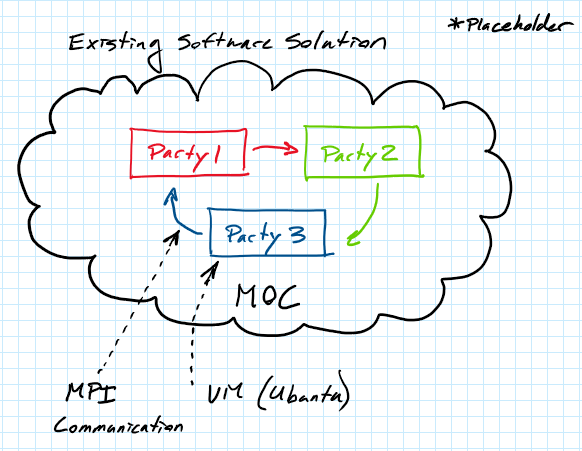

# Secure_MultiParty Background Information:
Performance analysis of secure multi-party computations in the cloud

Project Logistics:
Mentors: John Liagouris email: liagos@bu.edu;  Vasiliki Kalavri email: vkalavri@bu.edu;
Will the project be open source: yes

Preferred Past Experience:
Strong C/C++ programming skills: Required
OpenStack/OpenShift: Nice to have
MPI (Message Passing Interface): Nice to have
MPC (Multi-Party Computation): Nice to have

Project Overview:
Background: Secure multi-party computation (MPC) refers to a family of cryptographic protocols that allows distrustful parties to jointly perform arbitrary data computations while keeping the inputs and intermediate data of the computation private. Compared to traditional non-secure computations, MPC requires exchanging more data between parties and its performance relies heavily on the communication layer.

Project Specifics: In this project students will instrument and profile distributed MPC applications in the cloud with the goal to identify performance bottlenecks and potential optimizations. The analysis will focus on the networking layer. Students will experiment with different deployments, network libraries, and communication patterns (sync vs async) to identify optimal solutions based on the workload characteristics.

Some Technologies you will learn/use:
How to deploy applications in the cloud using VMs and OpenShift containers
How to instrument and profile distributed applications
MPI libraries: https://github.com/open-mpi/ompi , https://github.com/pmodels/mpich
MPC protocols: https://www.youtube.com/watch?v=P2MmO458xu4

---
# Project Proposal:
* Team Members:
  * Hasnain Abdur Rehman
  * Pierre-François Wolfe
  * Samyak Jain
  * Suli Hu

# 1. Visions and Goals of the Project:
The Cloud Computing MPC team will perform benchmarking of and provide insights on what performance improvements can be made to the MPC implementation provided by the projects mentors/sponsors John Liagouris and Vasiliki Kalavri. Accomplishing this will include:
* Profiling the existing software on the Massachusetts Open Cloud (MOC) under different deployment configurations.
* Performing testing while testing different communication configurations between computation parties (changing the settings for MPI or using alternatives).
* Exploring alternatives to the current single-process per party paradigm (e.g. multiple pthreads, OpenMP, etc.).
* Given sufficient progress on initial goals, exploring opportunities in running this MPC implementation on top of a BU developed Linux micro-kernel.

**__Questions:__**
* Is the final desired state meant to be "functionally the same" but with greater performance?
  * If so, is there some performance metric either relative or absolute that we should target?
    * Would that metric be based on some specific need (being able to do x many operations in y time)?
    * Canonical/reference tests to be used? Alternately, do these need to be developed or improved?
  * If not, what additional functionality or utility must be provided? (Some examples/ideas follow)
    * Configuration/launch tools to recreate different run scenarios on the MOC?
    * Automated testing/profiling chain to gather new data with different changes?
    * Improved frontend?
      * What is the current user interface and who can/can't make use of it?
      * Are we appropriately serving the target user audience? (Domain experts, outsiders, other?)
    * Improved backend?
      * Different MPC evaluation?
        * Change MPC primitives?
        * Make modifications to derived MPC operators?
        * Additional operators (extending functionality)?

---
# 2. Users/Personas of the Project:
The end-goal of this software is to be powerful and flexible enough to be attractive to non-MPC experts and provide a simple interface with greater performance than existing approachable software MPC alternatives. For the scope of this semester project however, we do not target a completely naïve user. Instead we require that a user be somewhat familiar with the concept of MPC. The goals are primarily performance oriented and are perhaps most appreciated by a more experienced user rather than a newcomer with no familiarity with the MPC offerings landscape.

**__Questions:__**
* The above statement is conjecture, please confirm it...
  * Are we targeting a specific lowest denominator of user?
    * Non-MPC expert?
    * Non-Hardware expert?
    * Casual user? (Not familiar with software development)
  * It would seem reasonable to separate long-term desired users and users targeted for the scope of this project.
    * If we are unsure, it would seem wisest to divide into users certain to be targeted, possible targeted, and definitely not targeted.

---
# 3. Scope and Features of the Project:
MPC Profiling
* Provide researcher insights into existing codebase
  * Provide a "best" execution configuration for the existing codebase
  * Identify bottlenecks and other areas for improvement to the library as implemented.

**__Questions:__**
* This will need far more detail, answering the earlier questions will help to inform this section.
* Once we know what users and what the user stories/envisioned high-level outcome is we can better ask questions concerning scope specifics...

---
# 4. Solution Concept:
* ToDo A high-level outline of the solutions
* Use a diagram to illustrate a high-level concept of the solution
  * Alternately, the appearance of the solution can be shown here if there is already an architectural diagram that exists for the project.
  * Note: Consider using LucidChart since it is available to BU students.
  * A walkthrough of the diagramed structure should exist.

**__Questions:__**
* Will need to see existing code to create a better sketch of the current architecture.
* Will need to find out more about the MOC to identify possible architecture/deployments
* Once user stories/vision is known we can define if there are specific frontend or backend architectures to define.

---
# 5. Acceptance Criteria:
* Establish a performance baseline.
  * Compare to prior-testing/published results
* Provide a thorough survey of the same software over a comprehensive set of deployment configurations with a range of software settings.
  * Make it possible to recreate the tested implementations.
  * Identify bottlenecks in tested implementations.
    * Select execution scenarios with the greatest potential.

**__Questions:__**
* Will this be purely or mostly performance based? What are the metrics?
* What features or outcome is sought?
* Can be define minimal goals (MVP) as well as stretch goals?
* If this is to be conducted primarily as a survey, what is the desired minimum reasonable amount of testing to be accomplished?

---
# 6. Release Planning:
ToDo: This section will need to show how incremental features and functions will be delivered...
- [ ] Identify user stories
- [ ] Associate user stories with different releases (One "release" per sprint with 5 sprints for the project)
  * This should ease/guide sprint/planning sessions
  * The initial iteration is expected/likely to have higher-level details.

**__Questions:__**
* After answering earlier questions this will be easier to plan
* If this is mostly a survey, the sprints will likely consist of increasingly granular benchmarking.
* If there are certain performance metrics to reach or features to implement then initially profiling might be the main goal with later sprints using initial profiling as a baseline
  * Note: perhaps an initial sprint will be to create a more automated benchmarking setup to help assess progress in later sprints?

---
# General Comments:
* ToDo
* WIP Notes:
  * [Project Description Template](https://github.com/BU-NU-CLOUD-SP18/sample-project/blob/master/README.md)
  * [Example Project Description](https://github.com/BU-NU-CLOUD-SP18/sample-project/blob/master/MOC-UI-ProjectProposalExample.md)
  * [GitHub Markdown Reference](https://github.com/adam-p/markdown-here/wiki/Markdown-Cheatsheet)
    * [Another Reference](https://docs.github.com/en/github/managing-your-work-on-github/about-task-lists)
